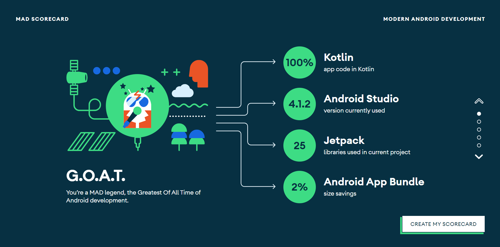

# covid19-tracker

An open-source Covid-19 tracking app written in Kotlin for Android

## MAD Score

[Link to the score](https://madscorecard.withgoogle.com/scorecard/share/3908347829/)



## Technologies used

- SDP - Scalable DP
- Timber - For logging
- Material Design - UI
  - Material Spinner
- Loading indicators - UI
- Retrofit2 - HTTP Requests
- Kotlin Coroutines - Async tasks

## Getting Started

- Clone the repository

```shell
git clone https://github.com/MichaelGrigoryan25/Covid19-Tracker.git
```

- Open the project folder in Android Studio
- Create a RapidAPI account at https://rapidapi.com/signup then go to https://rapidapi.com/api-sports/api/covid-193 and get your credentials
- Update your credentials on gradle.properties

- Build and Run your project

That's it! You have successfully configured and installed the Covid-19 Tracker!

If you liked the project, please give a ⭐ to it!
